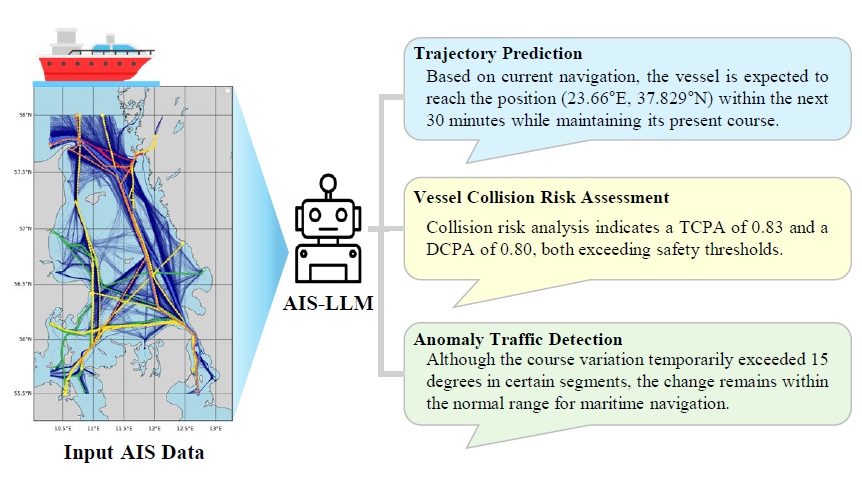

# AIS-LLM: A Unified Framework for Maritime Trajectory Prediction, Anomaly Detection, and Collision Risk Assessment with Explainable Forecasting

**Overview of the AIS-LLM Framework.** The system takes maritime AIS data as input (left) and performs three key maritime traffic analysis tasks simultaneously through an integrated end-to-end architecture: (1) **Trajectory Prediction** – predicts vessel trajectories over a given time horizon; (2)**Vessel Collision Risk Assessment** – quantifies the likelihood of collisions and estimates a collision risk index; (3) **Anomaly Traffic Detection** – identifies abnormal vessel behaviors. All prediction results are accompanied by interpretable explanations in natural language.

## Abstract
With the increase in maritime traffic and the mandatory implementation of the Automatic Identification System (AIS), the importance and diversity of maritime traffic analysis tasks based on AIS data, such as vessel trajectory prediction, anomaly detection, and collision risk assessment, is rapidly growing. However, existing approaches tend to address these tasks individually, making it difficult to holistically consider complex maritime situations. To address this limitation, we propose a novel framework, AIS-LLM, which integrates time-series AIS data with a large language model (LLM). AIS-LLM consists of a Time-Series Encoder for processing AIS sequences, an LLM-based Prompt Encoder, a Cross-Modality Alignment Module for semantic alignment between time-series data and textual prompts, and an LLM-based Multi-Task Decoder. This architecture enables the simultaneous execution of three key tasks: trajectory prediction, anomaly detection, and risk assessment of vessel collisions within a single end-to-end system. Experimental results demonstrate that AIS-LLM outperforms existing methods across individual tasks, validating its effectiveness. Furthermore, by integratively analyzing task outputs to generate situation summaries and briefings, AIS-LLM presents the potential for more intelligent and efficient maritime traffic management.
